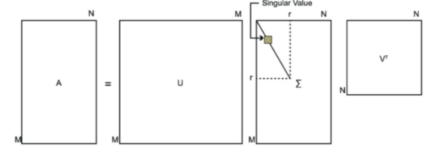

# 2020_7_28

## 今天的目标

OpenCV实现：对极几何和三角化

将 **对极几何** 的全部过程理解清楚，包括整个算法本身，**SVD分解**等等；

将 **三角化** 的全部过程理解清楚。

## 参考资料

https://note.youdao.com/ynoteshare1/index.html?id=5e98f487c40ef22f90e1177f29271be5&type=note

学习笔记：

1. SVD分解
   $$
   A = U{\Sigma}V^T
   $$
   

   根据下式求得的n个特征向量张成的向量矩阵就是 $V$
   $$
   (A^TA)v_i=λ_iv_i
   $$

   $$
   A=UΣV^T⇒AT=VΣ^TU^T⇒A^TA=VΣ^TU^TUΣV^T=VΣ^2V^T
   $$

   

   根据下式求得的m个特征向量张成的向量矩阵就是 $U$
   $$
   (A{\cdot}A^T)u_i=λ_iu_i最后根据已经求得的 $U$ 、$V$，求得最后的 $\Sigma$
   $$

   $$
   A = UΣV^T⇒AV=UΣV^T{\cdot}V⇒AV=UΣ⇒Av_i=σ_iu_i⇒σ_i=A\frac{v_i}{u_i}
   $$

   参考链接：

   https://zhuanlan.zhihu.com/p/26306568

   https://www.cnblogs.com/pinard/p/6251584.html	